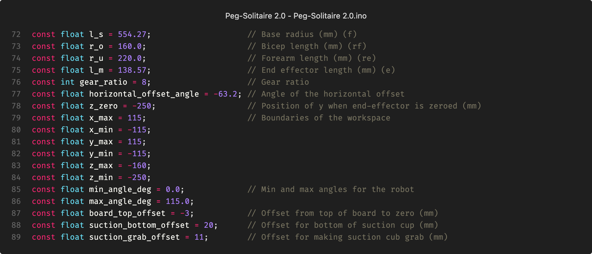
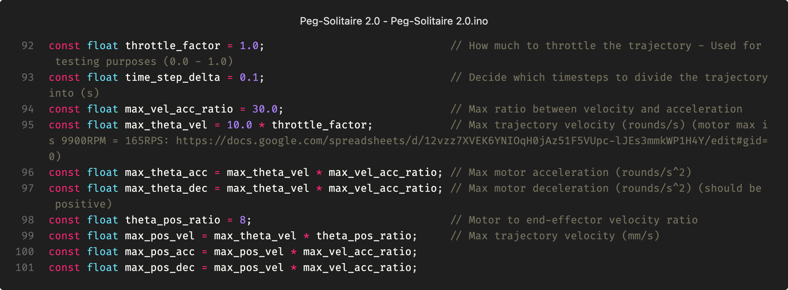

### Setting up the robot

For the best overview and to make the code easy to adjust for other robot projects, all the main parameters of the robot are defined in the main file `Peg-Solitaire 2.0.ino`. This is done in two sections: The first deals with the robot's physical parameters (figure 1), and the second deals with the robot's motion (figure 2).

As seen in figure 1, first, the well-known parameters for the robot's dimensions and gear ratio are defined. Then, a `horizontal_offset_angle` and `z_zero` are defined, which are used to zero the robot (more on that later), and some parameters are set for max/min positions and angles, which later in the code ensure that the robot's arms do not collide with its physical limitations. Finally, some offsets are defined, which are used to find the suction cup's position relative to the board game.

As seen in figure 2, here the parameters that determine the speed of the robot's movement are defined. These parameters need to be adjusted to optimize the robot's speed. It should be noted here that there are two sets of parameters for speed and acceleration. The first parameters are for the motors, and the next are for the mobile base. It should be noted here that the speed of the two things is related, and it is the speed of the motors that form the basis for the mobile base's speed. Why this is set up this way will be explained in a later section.

The constant `time_step_delta` defines what time intervals the mobile base's motion path is divided into. If we start with a movement that lasts 1 second, the path will be divided into 10 subpoints according to the definition below. The parameter `throttle_factor` is used for testing purposes as a quick way to reduce all other speeds.
